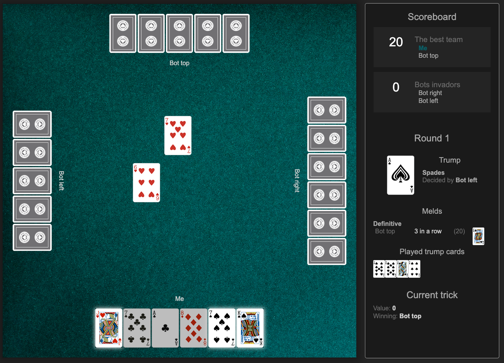

# Jass game

[](https://sonarcloud.io/summary/new_code?id=teemoo7_jass-game)
[](https://sonarcloud.io/summary/new_code?id=teemoo7_jass-game)

## Description

This is a simple implementation of the Swiss [Jass](https://en.wikipedia.org/wiki/Jass) card game (aka *Chibre* or
*Schieber*) in TypeScript, with Vite as a Node.js framework. The code repository is hosted on GitHub and published on
GitHub Pages.

The game is made of a UI so that a human can play against 3 AI bots.

## Play

### Online

:boom: You can play the game online in your
browser: [https://www.micaelpaquier.com/jass-game](https://www.micaelpaquier.com/jass-game)

Please note that the UI is *a bit* responsive, but not fully optimized for mobile devices.

### Local

You may also play locally by cloning the repository and running the following commands:

```shell
npm install
npm run dev
```

Then open your browser at [http://localhost:5173/](http://localhost:5173/)

**Note:** Node.js must be installed on your machine.

## Screenshots



## Rules

If you don't know the game yet, you can find the rules [here](https://en.wikipedia.org/wiki/Jass#Schieber_rules).

Note that some rules might not have been implemented yet.

## Credits

* The cards images are from the [American Contract Bridge League resource center](https://acbl.mybigcommerce.com/52-playing-cards/).
* The green baize background image is from [rawpixel.com on FreePik](https://www.freepik.com/free-photo/dark-green-wall_4246302.htm).

## If I had more time

I would...

* Refactor for a cleaner code architecture.
* Improve code encapsulation and modularity.
* Add more tests (including UI tests).
* Implement more rules (e.g. "Marriage" meld)
* Implement more/better AI strategies.
